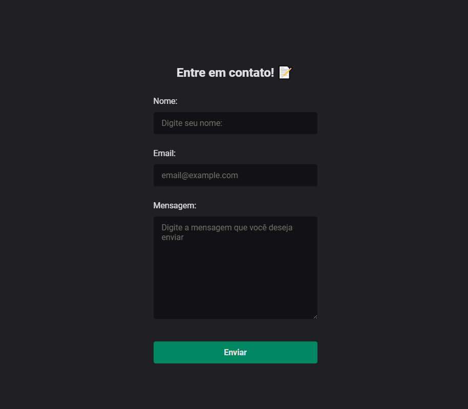

<h1 align="center"> React Contact Form </h1>

# Resumo do projeto

Formulário para contato Desenvolvido com ReactJS e Firebase!

## 🔨 Funcionalidades do projeto

- `Funcionalidade 1` `Envio de mensagens`: O usuário poderá entrar em contato com o dono da pagina enviando mensagens pelo formulário criado com os dados de: Nome, e-mail, e a mensagem digitada.

## ✔️ Técnicas e tecnologias utilizadas

- `React JS ⚛️`
- `Styled-Components 🎨`
- `Zod 🔐`
- `React-hook-form 📃`
- `Firebase 📙`
- `React-Toastify ⚠️`

## 📁 Acesso ao projeto

### Run

**Install dependencies**

```
npm install
```

**Run Dev**

```
npm run dev
```

Você pode acessar os arquivos do projeto clicando [aqui](https://github.com/luislong0/firebase-contact-form).
